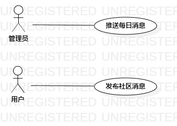

# 实验二：用例建模

## 一、实验目标
1.创建并完善选题

2.了解并掌握用例图的画法

3.通过github提交实验文档

## 二、实验内容
1.建立个人选题项目

2.根据自己的项目运用UMLStar绘制用例图

3.用git操作提交本次实验

## 三、实验步骤
 1.确立系统的功能(UseCase)
 - 每日推送
 - 发布社区信息
 - 查看社区信息
 
 2.根据功能建立Use Case
 确立系统的扮演者（Actor）
 - 用户
 - 管理员

 3.建立之间的联系（Association）

 4.编写用例规约

## 四、实验结果

 
## 表1: 推送每日信息用例规约

用例编号  | UC01 | 备注  
-|:-|-  
用例名称  | 推送每日信息  |  
前置条件  | 管理员登入系统  | *可选*  
后置条件  |   | *可选*  
基本流程  | 1. 系统进入每日推送界面  |  
~| 2. 管理员在文本框输入推送内容  |  
~| 3. 管理员点击推送按钮  |  
~| 4. 系统检查推送内容符合规范 |  
~| 5. 系统展示推送内容和询问是否确定发布 | 
~| 6. 系统推送信息，提示推送成功  | 
扩展流程  | 4.1 信息输入不合规范，系统提示发布失败  | *用例执行失败*  
~| 5.1 取消发布，返回编辑页面  | *用例执行失败*

## 表2: 发布社区信息用例规范

用例编号  | UC02 | 备注  
-|:-|-  
用例名称  | 发布社区信息  |  
前置条件  | 用户登入系统并获取到地址信息  | *可选*  
后置条件  |   | *可选*  
基本流程  | 1. 用户点击发布消息按钮  |  
~| 2. 系统进入消息编辑页面，获取用户地址信息  |  
~| 3. 用户在第一个文本框输入消息内容，在第二个文本框输入问题，在第三个文本框输入问题答案  |  
~| 4. 点击发布按钮  |  
~| 5. 系统检查发布内容符合规范  | 
~| 6. 系统展示推送内容和询问确定或者取消  |
~| 7. 系统发布用户编辑的信息和地址信息，提示发布成功  | 
扩展流程  | 4.1 信息输入不合规范，系统提示输入错误  | *用例执行失败* 
~| 5.1 用户消息内容含敏感内容，系统提示发布失败  | *用例执行失败* 
~| 6.1 取消发布，返回编辑页面  | *用例执行失败*

## 表3: 浏览社区信息用例规范

用例编号  | UC03 | 备注  
-|:-|-  
用例名称  | 浏览社区信息  |  
前置条件  | 用户登入系统并获取到地址信息  | *可选*  
后置条件  |   | *可选*  
基本流程  | 1. 点击社区主页按钮  |  
~| 2. 系统进入社区页面，列出所在周围社区消息的问题  |  
~| 3. 用户点击问题文字  |  
~| 4. 系统弹出消息窗口显示问题内容、文本框、退出和确定按钮  |  
~| 5. 用户输入问题答案后点击确定按钮  |
~| 6. 系统检查问题的答案相匹配  |
~| 7. 系统提示问题回答正确，显示所选问题的消息内容  |  
扩展流程| 4.1 退出问题，返回社区页面  | *用例执行失败* 
~| 6.1 问题回答错误，系统提示重新输入  | *用例执行失败*
